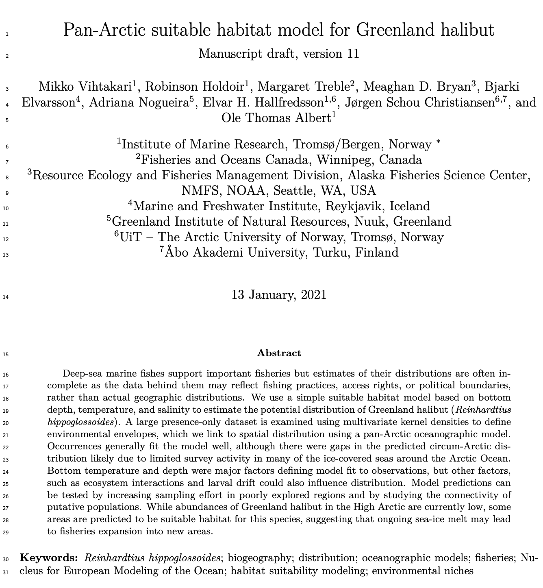
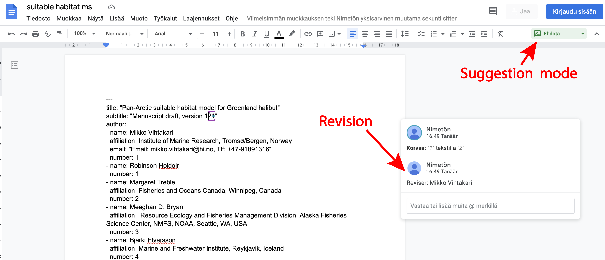

```{r setup, include=FALSE}
knitr::opts_chunk$set(echo = TRUE)
```

<style type="text/css">
  body{
  font-size: 14pt;
}
</style>

&nbsp;

This site contains information on how to write manuscripts, reports, and data analyses together using Rmarkdown (and Google Drive). If you have received this site as a link, you are probably collaborating on a project with the site author. 

**TL;DR**

Edit the manuscript in [Google Docs](#googledocs). Look at figures, tables, text, citations, and formatting in the [pdf file](#pdf). Place comments if you want to change the formatting or looks of something.

# Introduction

[Rmarkdown is a lightweight typography language](https://rmarkdown.rstudio.com/) enabling the use of [R code](https://www.r-project.org/) in documents. Manuscripts written using Rmarkdown are typically printed out as [pdf](https://en.wikipedia.org/wiki/PDF)s formatted for submission to a target journal. The main benefit of using Rmarkdown for manuscript writing over MS Word is that all numbers in the text, as well as figures and tables, are automatically updated when the underlying data or analyses change. This enables flexible and quick editing of the analysis until the manuscript is accepted decreasing the probability of any numbers from old analyses remaining in the document. As a coauthor, you do not need to worry about text formatting or the code bits in the text you see. All formatting and coding are taken care of by the lead author. 

Typically, when invited to collaborate, you will receive a **[pdf file](#pdf)** and a **link to [Google Docs document](#googledocs)**. The Google Docs document contains editable text and the pdf is the output of this text after compilation. 

The main benefit of using [Google Docs](https://www.google.com/docs/about/) (or other cloud-based editing software) is that you see the edits done by multiple coauthors in real-time. This saves your time as you do not end up doing the same corrections as another coauthor. Further, you can react to changes done by other coauthors without having to wait for cleaned versions of the manuscript. It also makes the lead author able to respond to coauthor contributions quicker as the Google Docs document will be updated and suggestion-corrected in a quicker cycle than a track-changed Word document sent through email. Alternative to Google Docs could be MS OneDrive and Sharepoint documents. From experience, Microsoft software works poorly across many institutions and systems as there seems always to be access problems to such documents. 

# The pdf file {#pdf}

The pdf file is or will be formatted for the target journal.  This file is where you **see figures and tables**. You will also see the text as output from R meaning that all numbers are shown as numbers and citations as citations. If the numbers are wrong or look weird, please let the lead author know. As a coauthor, you do not need to worry about text formatting but you may comment on the figure, table, and reference list formatting especially if these do not follow the style of the journal (unless you are asked not to do so in early phases of manuscript preparation).

```{r pdffile, fig.cap = "An example of pdf after evaluating (=knitting) the Rmarkdown code.", out.width='80%', echo = FALSE}

```

# Google Docs {#googledocs}

At the moment I share the editable text on Google Docs. For larger projects with many coauthors, I might not use any other protection than the link itself. Please do not distribute the link to outsiders. Any person having the link is likely able to read, copy and modify the text. 

Markdown text is generally just text with exception of R code chunks, references, and mathematical formulas. You may edit the text as you please, but please do not edit the code parts if you do not know what you are doing. For advanced users, the mathematical formulas behave identically to [LaTeX](https://en.wikibooks.org/wiki/LaTeX/Mathematics), while the [citations](https://bookdown.org/yihui/rmarkdown-cookbook/bibliography.html) and [cross-references](https://bookdown.org/yihui/rmarkdown-cookbook/cross-ref.html) have their own syntax. 

```{r googledocs, fig.cap = "An example of the Google Docs window. Use suggesting mode (top left) and comment your name to one of your revisions if you do not log in using a Google account. The language of the document will be determined based on your Google settings. Do not worry about it.", out.width='80%', echo = FALSE}

```

The link you received should take you automatically to suggestion mode (Figure \@ref(fig:googledocs)). If this is not the case, please change to suggestion mode in the right top corner so that the lead author can easier keep track of changes made to the document. If you are not logging in with your Google account, your comments will be marked as anonymous or whatever it is called in your language. Please place a comment on one of your edits clarifying who has edited the document to make it easier for the lead author to track contributions. 

## References

References to Rmarkdown are added from [`.bib` files](https://en.wikipedia.org/wiki/BibTeX) using a unique identifier code indicated by the `@` symbol. The citation style is defined by a [`.csl` file](https://en.wikipedia.org/wiki/Citation_Style_Language). In practice this means that you cannot change the references nor the citation style by manually editing them. These changes need to be done in the `.bib` and `.csl` files and are automatically carried over everywhere in the document. 

When you want to **add a reference**, please comment the URL or DOI on the citation you used. The lead author will then add the reference into the Rmarkdown code and pdf correctly. If you notice a wrongly formatted citation, please do not waste your time by manually editing them. Place a comment instead and the lead author will take care of the formatting.

## Editing

Apart from these details, the **manuscript editing should be a similar experience to using track-changes in MS Word**. Note that the document is **saved automatically every time you change something** and you do not need to worry about saving as long as you have internet connection. Undo (Ctrl/Cmd + Z) and redo (Ctrl/Cmd + Y) work similarly to MS Word. 

If you are not able to do the edits online, you may use the offline mode. Your edits will be uploaded the next time you connect to the internet but please note that the document may have changed in the meantime and **do not close your browser**. If you are working offline for longer periods of time, perhaps a safer way is to look for other alternatives to Google Docs.

# Alternatives to Google Docs

If Google Docs does not work for you, for example, because you prefer to edit offline or want to look at the formatted document, there are alternatives:

1. You may [download the document as a Word file](wikihow.com/Download-Google-Docs) and use track changes in MS Word (or similar software). You can then send the edited document to the lead author. Please note, however, that this way of collaborating will increase the workload of the lead author and editing on Google Docs is the preferred method.
2. If you want to comment on the formatted pdf document, you may refer to line numbers as if reviewing a manuscript, edit the pdf document using a [pdf editor](https://www.digitaltrends.com/computing/best-pdf-editors/) or annotate by hand and scan the annotations. Please note that especially the hand-writing and scanning option will be a considerable burden for the lead author and any other method is preferred.

# Authorship

As a general rule, we attempt to follow the [ICMJE criteria for authorship](http://www.icmje.org/recommendations/browse/roles-and-responsibilities/defining-the-role-of-authors-and-contributors.html):

1. Contribution to the concept, data acquisition, analysis, or interpretation; AND
2. Drafting or critical revision of the manuscript; AND
3. Final approval of the work to be published; AND
4. Agreement to be accountable for all aspects of the work

In larger projects, however, it may be difficult to keep track of all contributions and the criteria are simplified to the following: if **you feel that you fulfill the ICMJE criteria for authorship**, you will be listed as a coauthor in the manuscript. In other words, you will be offered an opportunity to contribute, which does not automatically equate to being listed as an author in the manuscript. The lead author will access the contributions and add the authors to the **author list in the order of contributions to the final accepted draft**. If you are not among the authors at a certain point of drafting the manuscript, you can request authorship and it will most often be granted, as long as you feel that you fulfill the criteria above. Please note, however, that any additional authors after submission need often to be declared to the journal editor. You may be asked to write a justification to be added as an author, so **please send authorship requests before submission**.

# Exploratory figures

More extensive data analyses may contain an exploratory figures file or a folder. These figures are there to understand the data and are not intended to be submitted together with the manuscript. If you feel that some of the exploratory figures should be added to the supplementary material, please let the lead author know.

# Advanced editing and learning Rmarkdown

If you are interested to learn Rmarkdown, you may ask the lead author for access to the private GitHub repository where the analyses and manuscript are stored. Apart from that, you may borrow the yaml part of the document and you should be able to produce your own Rmarkdown documents with it. The csl and bib (citation style and reference list, respectively) files are often stored in a subdirectory to the Rmarkdown document. You will need these files to add citations. Please ask the lead author for them. 